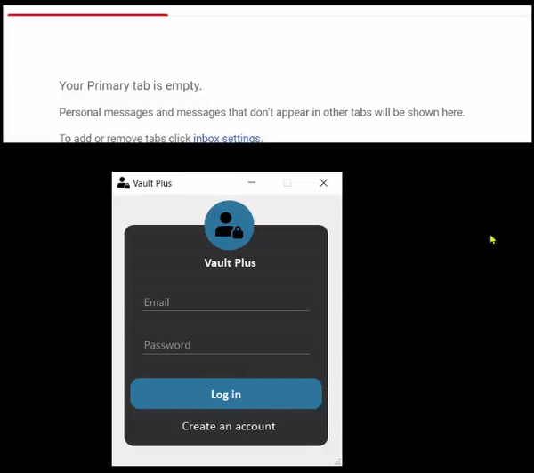
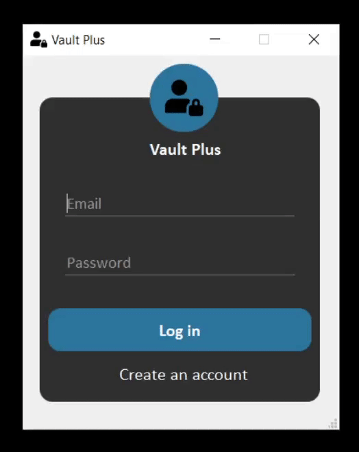

# Vault Plus - Password Manager

Vault Plus is a local password manager that is created to demonstrate one of the use cases of the `Sequence Based Two-Factor Authentication (2FA) Method`. This is a new 2FA method that works by having users derive OTP (One Time Password) from a pre-generated sequence of characters, eliminating the need to have a physical device to use 2FA both online and offline. 

More details can be found in the [paper](https://link.springer.com/chapter/10.1007%2F978-3-030-60700-5_15).

> Note: Vault Plus encrypts user passwords but, it doesn't encrypt the database (.db) files. This functionality of the encrypting the database (.db) files will be provided in the future.

There are two ways of using this 2FA method:
1. Online
2. Offline

## Online Implementation

In this implementation, the user will receive a 9-digit random code via email, and then the user will use the code and their sequence to derive an OTP and use that OTP for authentication. After every 60 seconds, a new randomly generated code is sent. Sending the random codes to the email address of the user `increases security`. [Click here](https://youtu.be/81jn8GlU5dU) to see the full demo.



## Offline Implementation

In this implementation, the 9-digit random code will be shown within the application. After every 60 seconds, the code will be updated. Generating the random codes within the application `improves usability`. [Click here](https://youtu.be/8ZUJ1yRRsYM) to see the full demo.



## Technical Details

* The GUI (Graphical User Interface) application is made using `PyQt5`.
* The database used is `SQLite`.
* The user's master password is encrypted using `SHA256`.
* The user's password for a service (i.e. Amazon, Google etc.) is encrypted using `AES256`.

## Setup

### Windows

Open Anaconda Prompt and create a conda environment using the following command:

```
conda env create -f environment.yaml
```

For using an online implementation of this 2FA method, you'll need to enter your email address and password to the `config.json` file. If you're using Gmail as the provider, you'll need to tell Google to allow you to connect via SMTP.For many other email providers, you won't need to do any of the extra steps that I describe here.

* You'll need to turn on allow less secure apps to access your account. For detailed instructions on how to do this, you should check out this [page](https://support.google.com/accounts/answer/6010255).

* If you have 2-step verification enabled on your account, then you'll need to create an app-specific password for less secure apps like this. In that case, you'll need to follow the instructions [here](https://support.google.com/accounts/answer/185833).

## How To Use

1. Clone this repository. 

```
git clone https://github.com/devanshamin/VaultPlus.git
```

2. Open Anaconda Prompt and type following commands. 

```
conda activate vaultplus
cd VaultPlus
python main.py
```

## To Do

- [ ] Support for encrypting the database (.db) files.

## License

Open source licensed under the MIT license (see LICENSE file for details).