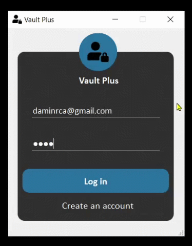

# Vault Plus Password Manager

Vault Plus is a local password manager that was created to demonstrate one of the use cases of `Sequence Based Two-Factor Authentication (2FA) Method`. The 2FA method works by having users derive OTP (One Time Password) from a pre-generated sequence of characters, eliminating the need to have a physical device to use 2FA both online and offline. 

More details can be found in the [paper](https://link.springer.com/chapter/10.1007%2F978-3-030-60700-5_15).

> Note: Vault Plus encrypts user passwords but it doesn't encrypt the database. The database encryption functionality will be provided in the future.

There are two ways of using this 2FA method:

1. Online

In this implementation, the user will receive a random 9-digit code via email, and then the user will use the code and their sequence to derive an OTP and use that OTP for authentication. Every 60 seconds a new randomly generated code is sent. Sending the random codes to the email address of the user `increases security`.

2. Offline

In this implementation, the OTP will be shown within the application instead of sending it to the user via email. Generating the random codes within the application `improves usability`.

## Architecture

## Technical Details

* The GUI (Graphical User Interface) application is made using `PyQt5`.
* The database used is `SQLite`.
* The master password is encrypted using `SHA256`.
* The user's password for a service (i.e. Amazon, Google etc.) is encrypted using `AES256`.